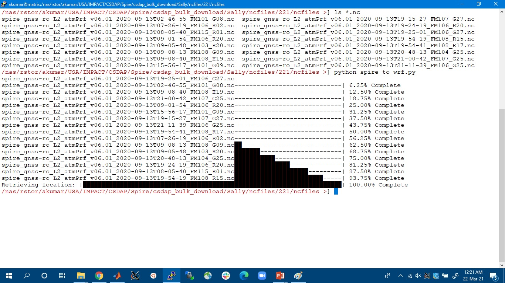
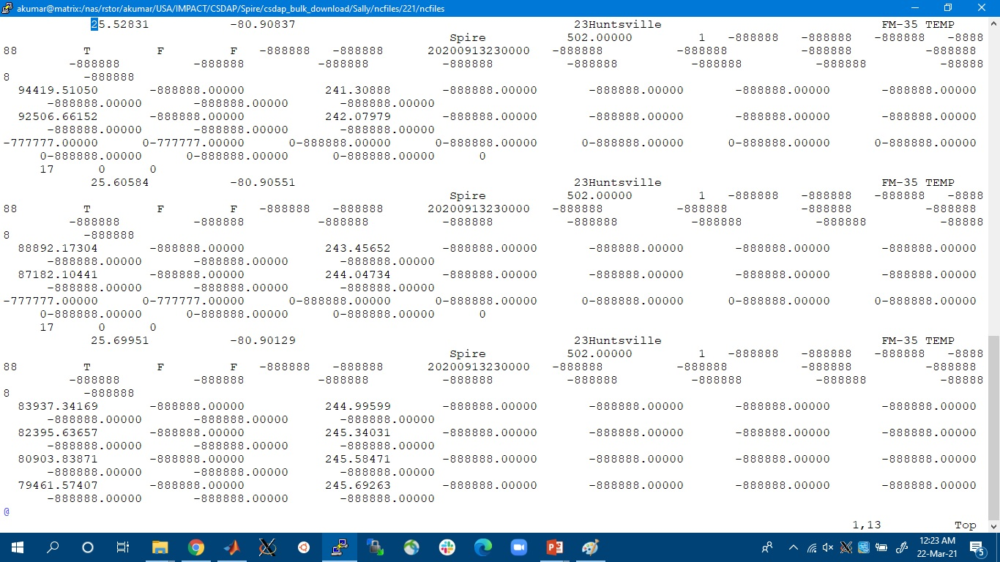
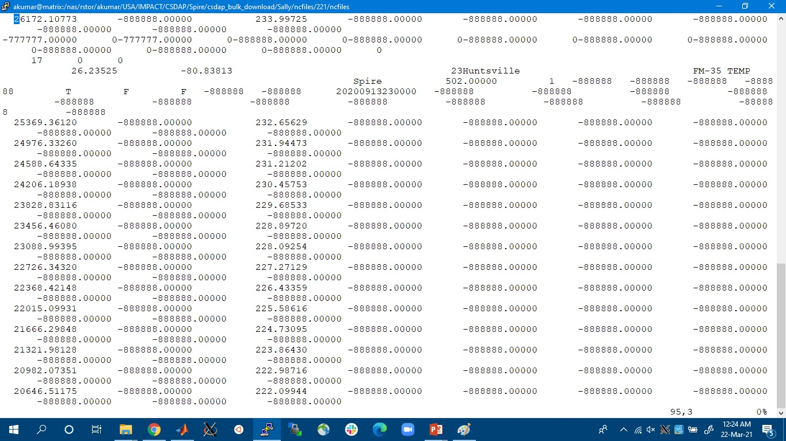
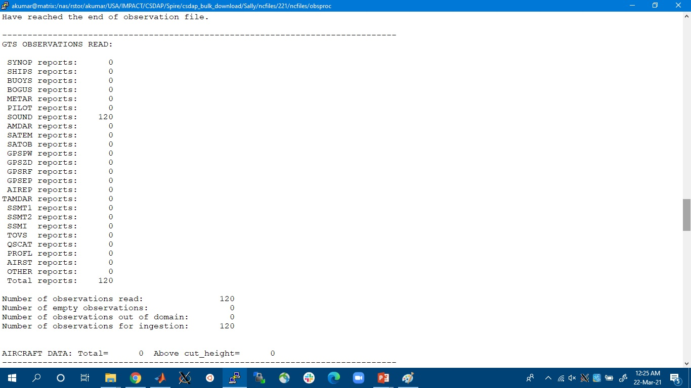
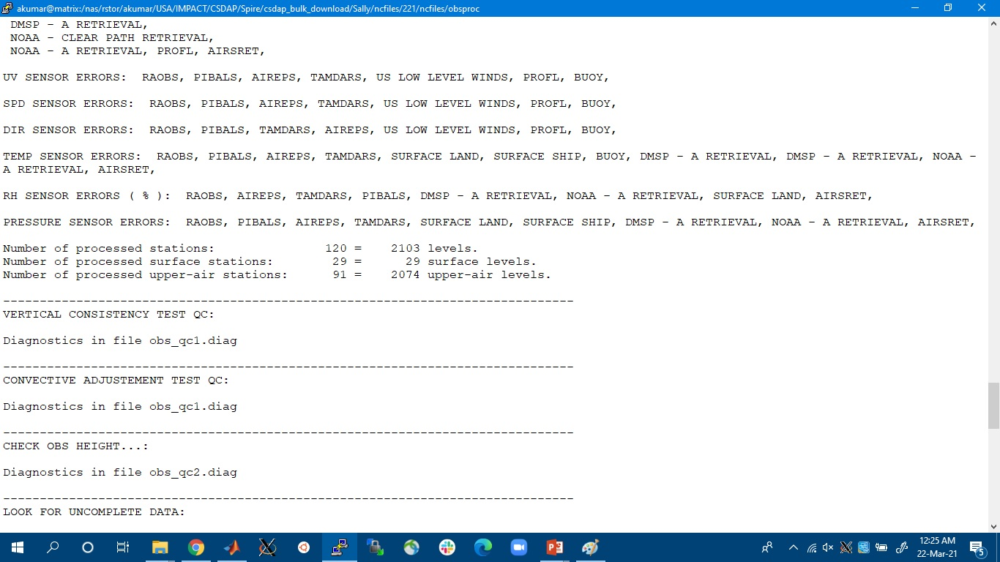
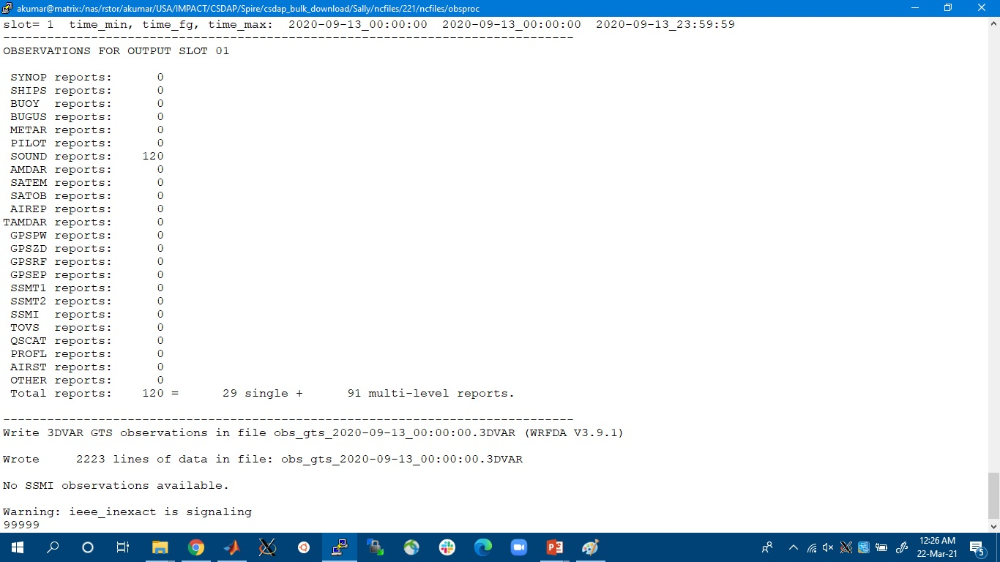
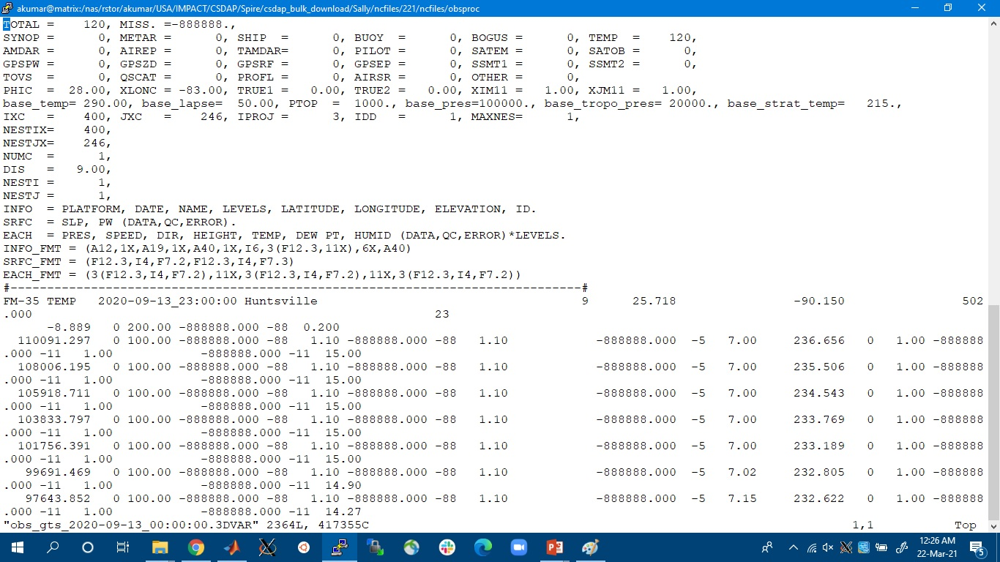
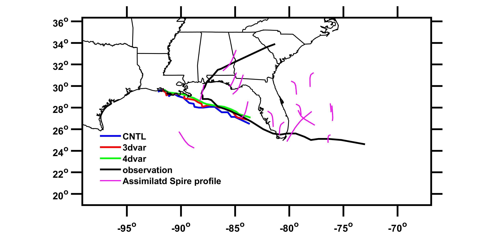
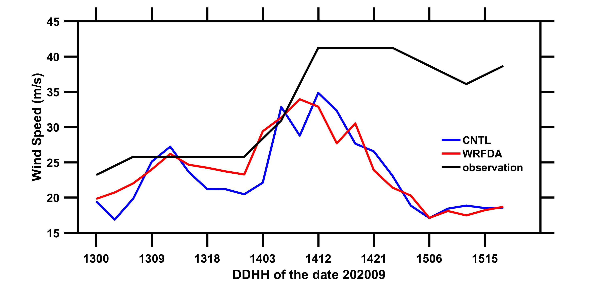

# spire_to_wrf

## Description
User can create a file having the spire data in a specific format so that it can be ingested into The Weather Research and Forecasting Data Assimilation (WRFDA) as an input to the obsproc (an executable in WRFDA).

## Required Libraries
sys, pandas, xarray, numpy, math, glob, argparse, datetime, math, time, SimpleNamespace

## Arguments
This tool needs 2 optional arguments as follows,

1. _spat_res_: Spatial Resolution of the simulation (in km). Default value of this argument is 10km, and it will be considered if the user does not provide this optional argument.

2. _output_filename_: Filename of the output text file. Default value of this argument is _spire_wrfda_input.txt_.

## Examples 

1. User needs to specify spat_res, end_date and _output_filename_ as arguments

`$ python spire_to_wrf.py  --spat_res=15 --output_filename='spire_wrfda_input.txt`

`$ python spire_to_wrf.py  --spat_res=15`

2. User can chose not to provide any arguments. If not provided, program will automatically take 10 km as the _spat_res_, and _spire_wrfda_input.txt_ as output_filename
`$python  spire_to_wrf.py`

## Steps involved in ingesting Spire into WRFDA
**Step 1**: Order Spire data from SDX (https://csdap.earthdata.nasa.gov/), and download the data using Bulk Downloader script (https://github.com/NASA-IMPACT/csdap_bulk_download).

**Step 2**: Once we have the Spire profile data in a folder, we can use _spire_to_wrf_ package to create input file for the WRFDA observation processor (_obsproc_).

Created file from this step would look something like this, which contains header and data entries for multiple stations:

**Step 3**: Next step is to run obsproc.exe, which is an WRFDA executable for preparing conventional observations for assimilation by WRFDA. The purpose of OBSPROC is to:

·       Remove observations outside the specified temporal and spatial domains

·       Re-order and merge duplicate (in time and location) data reports

·       Retrieve pressure or height based on observed information using the hydrostatic assumption

·       Check multi-level observations for  vertical consistency and superadiabatic conditions

·       Assign observation errors based on a pre-specified error file

·       Write out the observation file to be used by WRFDA in ASCII or BUFR format

While compiling obsproc.exe, the details like the number of observations ingest, number of stations processed will be displayed

This step results into creating conventional observations file, which would look like:

Detailed description of the steps involved in WRF data assimilation can be found in the WRF user guide (https://www2.mmm.ucar.edu/wrf/users/docs/user_guide_V3/user_guide_V3.9/contents.html).

## Results from a test cases

These are the results prepared by running a test case of hurricane Sally (September 11, 2020 – September 18, 2020).

A)  Observed hurricane track and model simulated track, overlapped with the assimilated Spire profile data

B) Time series of the wind speed derived from the cntl and 3dvar simulation, along with the observed wind speed

